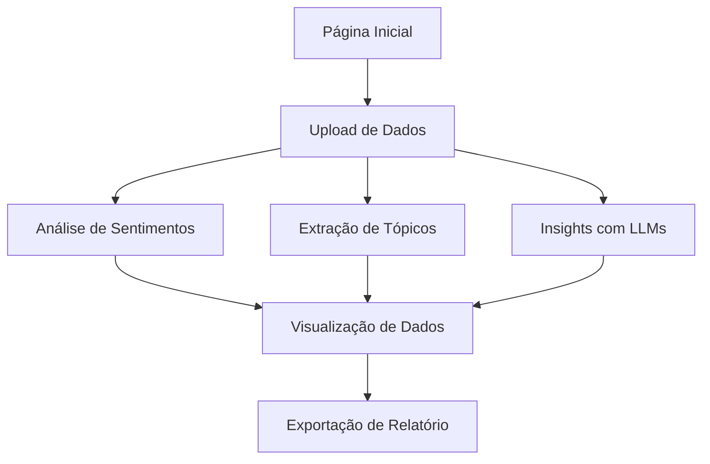

# AMEI, NOTA ZERO

## MODELO CONCEITUAL

```mermaid
flowchart TD

    Home["Página Inicial"]
    Upload["Upload de Dados"]
    Sent["Análise de Sentimentos"]
    Topics["Extração de Tópicos"]
    Insight["Insights com LLMs"]
    Viz["Visualização de Dados"]
    Exp["Exportação de Relatório"]
    Home --> Upload
    Upload --> Sent & Topics & Insight --> Viz
    Viz --> Exp
```