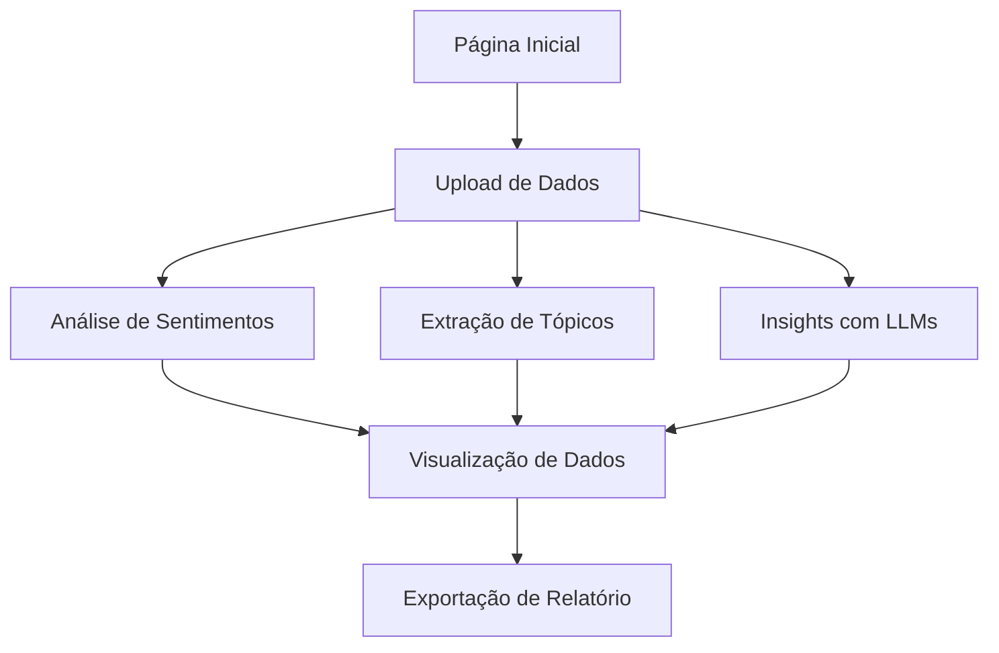

# AMEI, NOTA ZERO

Aplicativo interativo desenvolvido com Streamlit para análise automatizada de avaliações textuais em negócios online. Ele transforma comentários de clientes em insights acionáveis, facilitando a tomada de decisão para microempreendedores.

## FUNCIONALIDADES

- Upload de arquivos (CSV, Excel, TXT, JSON)
- Análise de sentimento (Positivo, Neutro, Negativo)
- Extração de tópicos mais frequentes
- Geração de resumo e recomendação inteligentes
- Visualização de dados com gráficos
- Exportação de relatório final

## MODELO CONCEITUAL



## ESTRUTURA DO PROJETO

amei-nota-zero/
├── main.py
├── componentes/
│   ├── acessibilidade.py
│   ├── layout.py
│   └── navegacao.py
├── estilos/
│   └── visual.py
├── funcionalidades/
│   ├── carregamento.py
│   ├── nlp.py
│   ├── user_crud.py
│   └── visualizacao.py

## INSTALAÇÃO

1. Clone o repositório:

    ```bash
    git clone https://github.com/seu-usuario/amei-nota-zero.git
    cd amei-nota-zero
    ```

2. Crie e ative um ambiente virtual:

    ```bash
    python -m venv .venv
    source .venv/bin/activate  # Linux/macOS
    .venv\Scripts\activate     # Windows
    ```

3. Instale as dependências:

    ```bash
    pip install -r requirements.txt
    ```

### Como Executar

```bash
streamlit run main.py
```

## PRINCIPAIS REQUISITOS

- Streamlit
- Pandas
- Altair
- FPDF2
- Hugging Face Hub
- LangChain

Todas as dependências estão listadas no `requirements.txt`.

## AUTORIA

Projeto Integrador — Univesp
Grupo DRP01-PJI240-SALA005GRUPO-006
Desenvolvido por Aline Maria dos Santos, Jaqueline Costa e equipe.

## LICENÇA

Este projeto é de uso acadêmico e está disponível sob a licença MIT.
Sinta-se livre para adaptar e expandir conforme sua necessidade.
